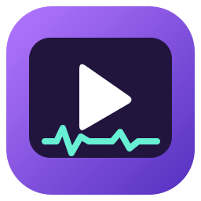

  

<h1 align="center">OctaStudio Beta</h1>

<strong>Edita video, ajusta audio y crea subtítulos desde tu PC.</strong>

Windows 10 / 11 · 64 bits · Interfaz en español

  <a href="https://github.com/Sergio5331/OctaStudio/releases/tag/v1.0.1-beta.1"><strong>Descargar OctaStudio Beta</strong></a>
  &nbsp; · &nbsp;
  <a href="https://github.com/Sergio5331/OctaStudio/issues/new?template=error.yml">Reportar un problema</a>

---

OctaStudio es un editor de video y audio para Windows. Reúne una línea de tiempo, textos personalizables, imágenes superpuestas y reconocimiento de voz local para generar subtítulos.

**Está en fase beta.** Las funciones siguen evolucionando y pueden aparecer errores. Esta publicación permite probar la aplicación y compartir comentarios para mejorarla.

## Qué puedes hacer

- **Editar video:** organizar clips, recortar, dividir y ajustar su duración.
- **Personalizar textos e imágenes:** moverlos sobre el video, cambiar estilos y aplicar animaciones. Los cuadros de texto acomodan el contenido sin deformar las letras.
- **Dar estilo a tus videos:** filtros, efectos, ajustes de color y velocidad.
- **Crear subtítulos automáticos:** reconocimiento local con el modelo incluido y colocación en la línea de tiempo.
- **Procesar audio por lotes:** ajustar varios archivos con protección de picos para reducir la saturación.
- **Exportar el proyecto:** guardar el video en MP4 o exportar solo audio.

## Descargar e instalar

1. Abre [la versión 1.0.1 Beta](https://github.com/Sergio5331/OctaStudio/releases/tag/v1.0.1-beta.1).
2. En **Assets**, descarga **OctaStudio-Setup-1.0.1.exe** — aproximadamente **262 MB**.
3. Ejecuta el instalador y sigue el asistente en español.
4. Abre **OctaStudio** desde el escritorio o el menú Inicio.

El instalador incluye Python, FFmpeg y el modelo de subtítulos. **No necesitas instalar Python por separado.** Puedes desinstalar la aplicación desde Configuración → Aplicaciones de Windows.

Si ya tienes OctaStudio, cierra la aplicación e instala la actualización en la misma carpeta.

## Requisitos y estado de la beta

| Elemento | Compatibilidad |
| --- | --- |
| Sistema | Windows 10 u 11 de 64 bits |
| Interfaz | Microsoft Edge, Google Chrome o un navegador compatible actualizado |
| Subtítulos | Modelo incluido; el reconocimiento se ejecuta en el equipo |
| Fuentes | Se utilizan las fuentes disponibles en Windows |
| Firma digital | El instalador todavía no está firmado; Windows puede mostrar un aviso |

Las pruebas se han realizado en el equipo de desarrollo. La compatibilidad con otros equipos continúa en evaluación. El reconocimiento de voz puede cometer errores: revisa los subtítulos antes de exportar.

## Novedades de 1.0.1 Beta

- Los selectores de archivos, guardado y carpetas aparecen sobre la ventana de OctaStudio.
- Los textos se acomodan en líneas conservando el tamaño de letra elegido.
- Instalador para Windows con icono y acceso directo.

## Comentarios y errores

Abre un [reporte de problema](https://github.com/Sergio5331/OctaStudio/issues/new?template=error.yml) e indica la versión de OctaStudio, tu versión de Windows y los pasos para reproducirlo. Una captura del error ayuda a entenderlo.

Este repositorio reúne **instaladores, información de las versiones y reportes de la beta**. No contiene el código fuente de la aplicación.

Desarrollado por <a href="https://github.com/Sergio5331">Sergio</a> · OctaStudio Beta

